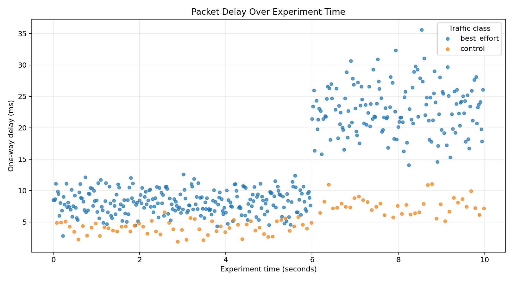
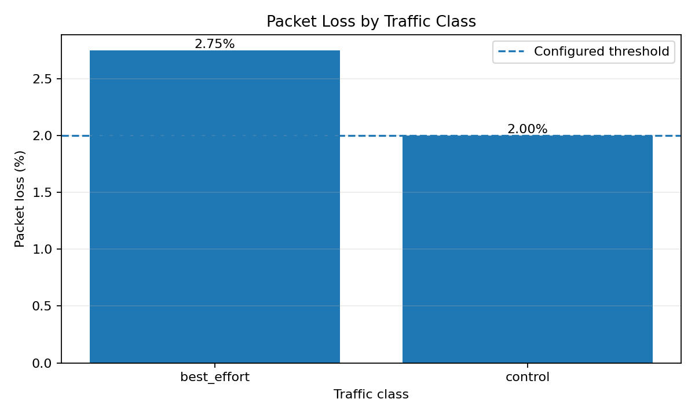

# Network Resilience Analyzer

A small Python toolkit for analyzing packet-level communication experiments. It calculates delay, tail delay, jitter, packet loss, throughput, and threshold violations for the complete experiment and for each traffic class.

The included dataset is **synthetic**. It models a network that becomes more congested during the second half of the experiment, so the analyzer can demonstrate how degradation is detected without publishing private research data.

## Why I built this

My academic and professional background includes Linux, TCP/IP networking, monitoring, and simulation-based evaluation of heterogeneous TSN–5G communication systems. This project turns that experience into a small, reproducible software tool that can be reviewed and executed independently.

## Features

- Reads packet-level experiment data from CSV
- Calculates mean, maximum, and 95th-percentile delay
- Calculates packet-delay variation as jitter
- Calculates packet loss and delivered throughput
- Separates results by traffic class
- Detects violations of configurable service targets
- Applies the throughput target to the complete experiment while reporting per-class throughput separately
- Exports a JSON report and two PNG charts
- Includes automated tests and a GitHub Actions workflow

## Input format

The CSV file must contain these columns:

| Column | Meaning |
|---|---|
| `packet_id` | Unique packet identifier |
| `sent_time_ms` | Packet transmission time in milliseconds |
| `received_time_ms` | Reception time; empty for a lost packet |
| `packet_size_bytes` | Packet size in bytes |
| `delivered` | `1` for delivered, `0` for lost |
| `traffic_class` | For example `control` or `best_effort` |

## Run on Windows

Open PowerShell in the project directory and run:

```powershell
python -m venv .venv
.\.venv\Scripts\Activate.ps1
python -m pip install -e ".[dev]"
network-resilience-analyzer data/sample_network_data.csv --output output
```

The generated files will be placed in `output/`:

```text
output/
├── resilience_report.json
├── delay_over_time.png
└── packet_loss_by_class.png
```

Run the automated tests with:

```powershell
pytest -q
```

## Example result

The sample data produces a `DEGRADED` overall status because packet loss exceeds the configured service target. The control traffic remains more stable than best-effort traffic.





## Example command options

```powershell
network-resilience-analyzer data/sample_network_data.csv `
  --max-mean-delay 15 `
  --max-p95-delay 30 `
  --max-jitter 6 `
  --max-loss 2 `
  --min-throughput 0.25
```

## Project structure

```text
network-resilience-analyzer/
├── data/                         # Synthetic example data
├── docs/                         # Example charts shown in this README
├── src/network_resilience_analyzer/
│   ├── analyzer.py               # Metrics and threshold evaluation
│   ├── cli.py                    # Command-line interface
│   └── visualizer.py             # Charts
├── tests/                        # Automated unit tests
├── .github/workflows/tests.yml   # Continuous integration
└── pyproject.toml                # Python package configuration
```

## What I learned

- Designing a reproducible data-analysis pipeline
- Separating metric calculation, visualization, and command-line code
- Validating input data and handling packet loss explicitly
- Writing automated tests for network-performance calculations
- Running tests automatically with GitHub Actions

## Possible next steps

- Add rolling-window metrics to locate the exact start of degradation
- Compare multiple experiments and network loads
- Export a human-readable HTML report
- Add confidence intervals and experiment-to-experiment statistics
- Import OMNeT++ scalar and vector results

## License

MIT
